Selanjutnya adalah **29_sequence_diagram.md**. Saya menyarankan dokumen ini menggunakan **Mermaid Sequence Diagram** agar dapat langsung dirender di GitHub, GitLab, Obsidian, MkDocs, Docusaurus, maupun berbagai tool dokumentasi modern.

Untuk modul Question Bank, sequence diagram sebaiknya tidak hanya mencakup CRUD, tetapi juga seluruh business flow utama yang telah didefinisikan pada PRD, Backend Architecture, dan Database Specification.

---

````markdown
# 29_sequence_diagram.md

# Question Bank Sequence Diagram

Version : 1.0

---

# 1. Overview

Dokumen ini berisi sequence diagram utama
pada modul Question Bank.

Diagram menggunakan Mermaid
agar dapat dirender secara otomatis
oleh berbagai platform dokumentasi.

---

# 2. Create Question

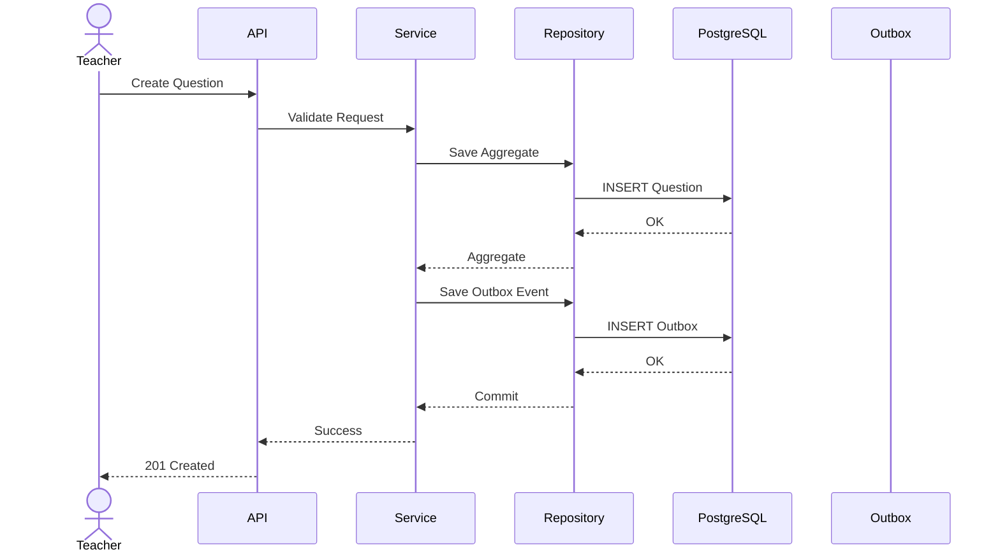

---

# 3. Publish Question

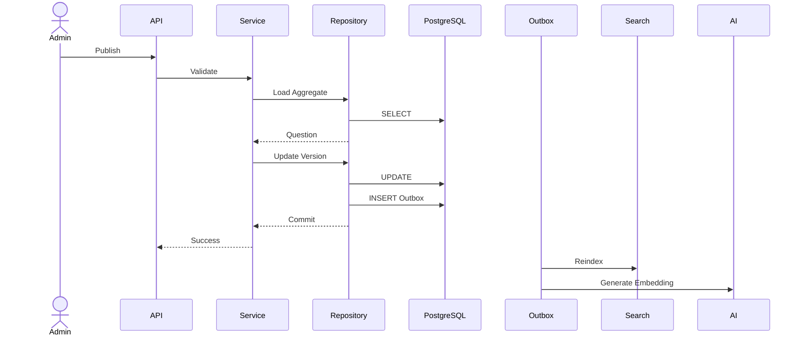

---

# 4. Review Question

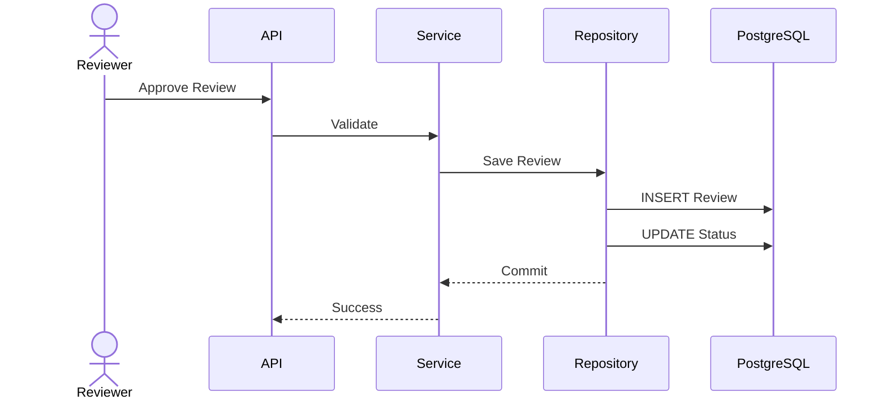

---

# 5. Search Question

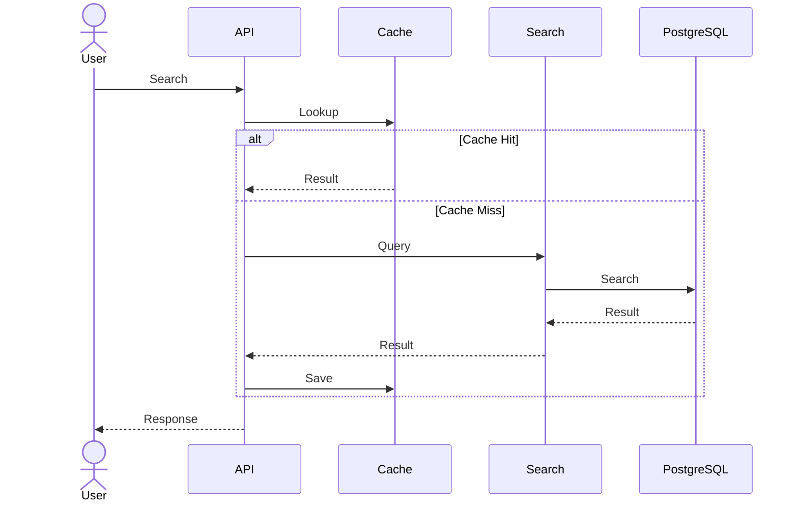

---

# 6. Semantic Search

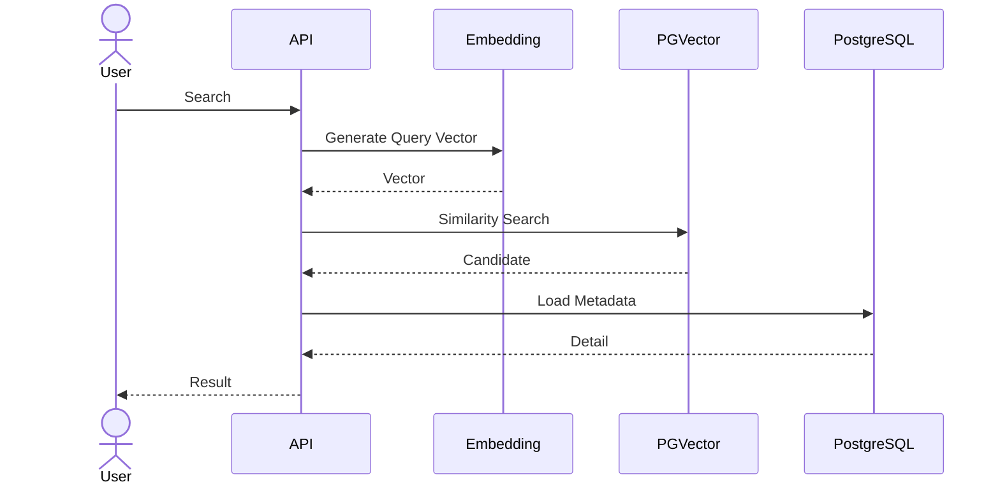

---

# 7. Import Question

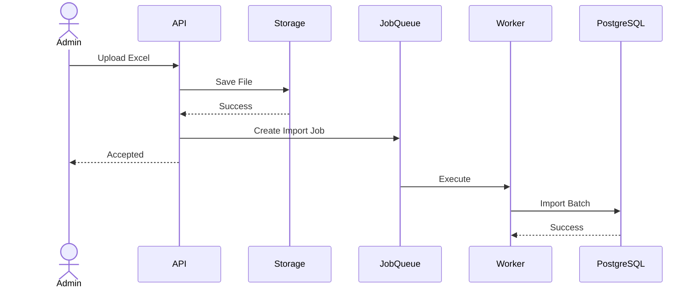

---

# 8. Export Question

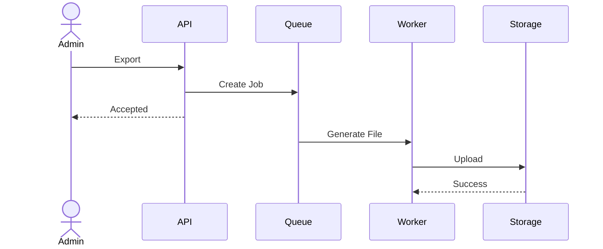

---

# 9. AI Question Generation

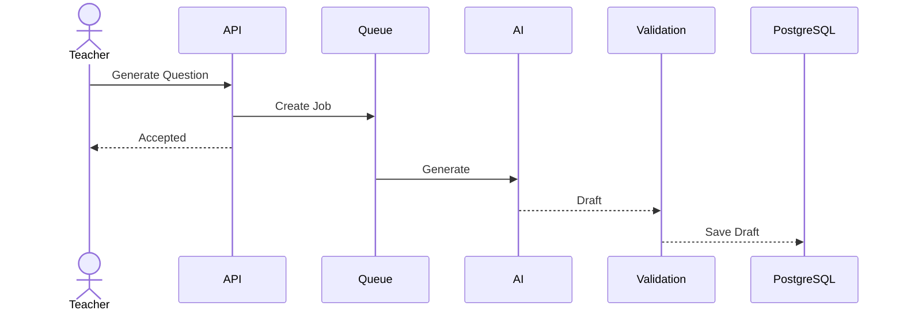

---

# 10. Duplicate Detection

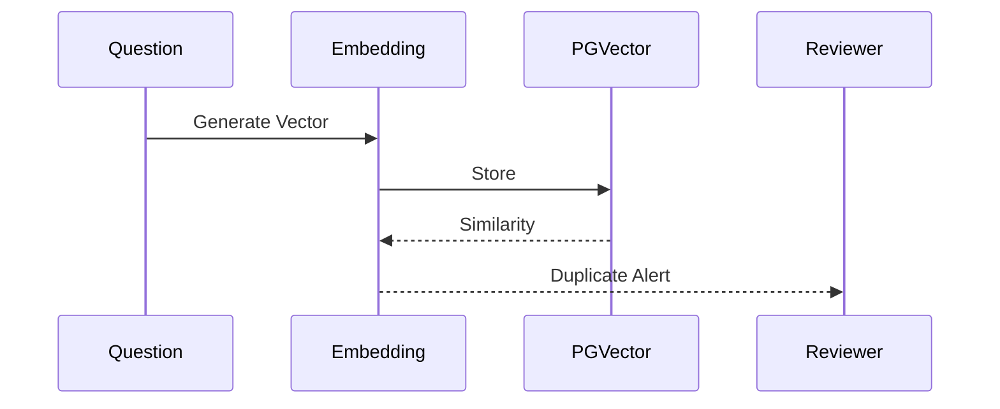

---

# 11. Attachment Upload

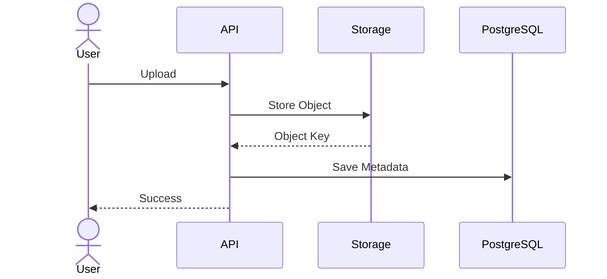

---

# 12. Cache Invalidation

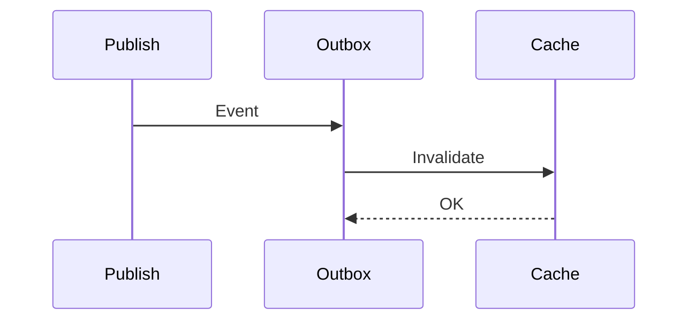

---

# 13. Event Publishing

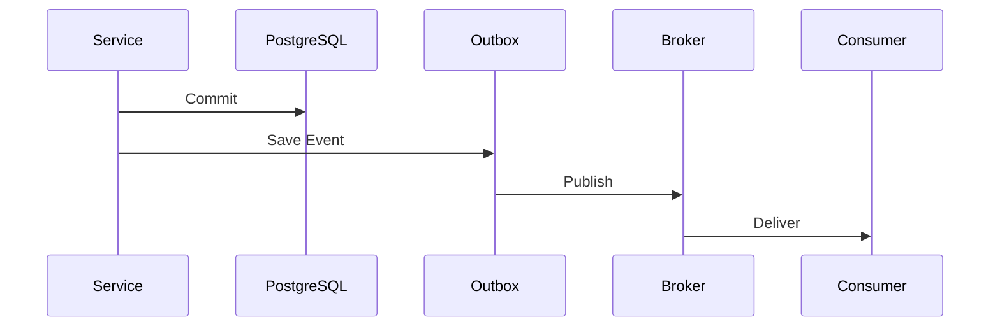

---

# 14. Audit Logging

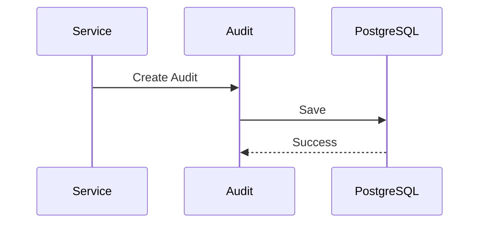

---

# 15. Background Job Retry

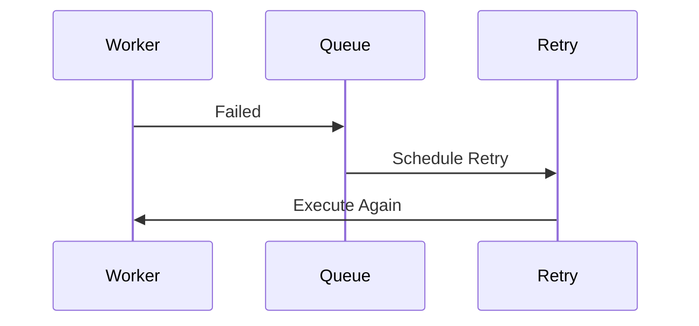

---

# 16. Future Diagrams

Dokumen ini akan diperluas dengan.

- Bulk Import
- Adaptive Learning
- Recommendation Engine
- AI RAG Pipeline
- CQRS Projection
- Distributed Transaction
- Multi Region Synchronization
````

---

# Rekomendasi Penyempurnaan

Untuk YakinLulus.id, saya menyarankan **seluruh sequence diagram dibagi menjadi tiga kategori** agar dokumentasi tetap mudah dipelihara.

## 1. User Flow

```text
Teacher → Create Question
Reviewer → Review
Admin → Publish
Student → Search
```

Berfokus pada interaksi aktor dengan sistem.

---

## 2. System Flow

```text
API
↓
Application Service
↓
Repository
↓
Database
↓
Outbox
↓
Event Broker
```

Berfokus pada alur internal backend.

---

## 3. Infrastructure Flow

```text
API
↓
Redis
↓
PostgreSQL
↓
Object Storage
↓
Message Broker
↓
Background Worker
```

Berfokus pada interaksi dengan komponen infrastruktur.

---

# Diagram yang Direkomendasikan untuk Fase Berikutnya

Saat modul lain (Material, CBT Runtime, Analytics, AI, Notification) selesai, saya menyarankan menambahkan sequence diagram lintas bounded context, misalnya:

* **Question Bank → CBT Runtime** (sinkronisasi soal setelah publish)
* **Question Bank → AI Engine** (embedding dan RAG)
* **Question Bank → Analytics** (penggunaan soal dan pembaruan statistik)
* **Question Bank → Notification** (notifikasi review atau import selesai)
* **Question Bank → File Management** (unggah dan pemrosesan aset)

Dengan pendekatan ini, dokumentasi tidak hanya menggambarkan alur di dalam modul Question Bank, tetapi juga hubungan antarmodul yang menjadi inti arsitektur YakinLulus.id.
