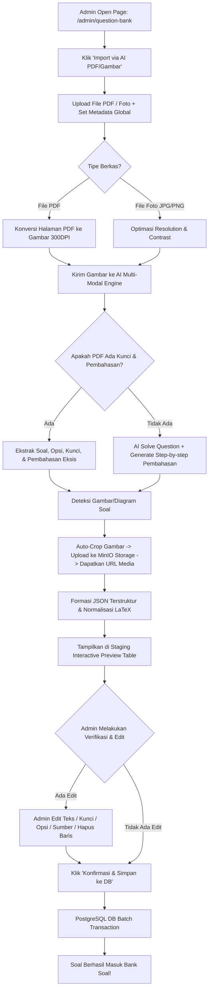
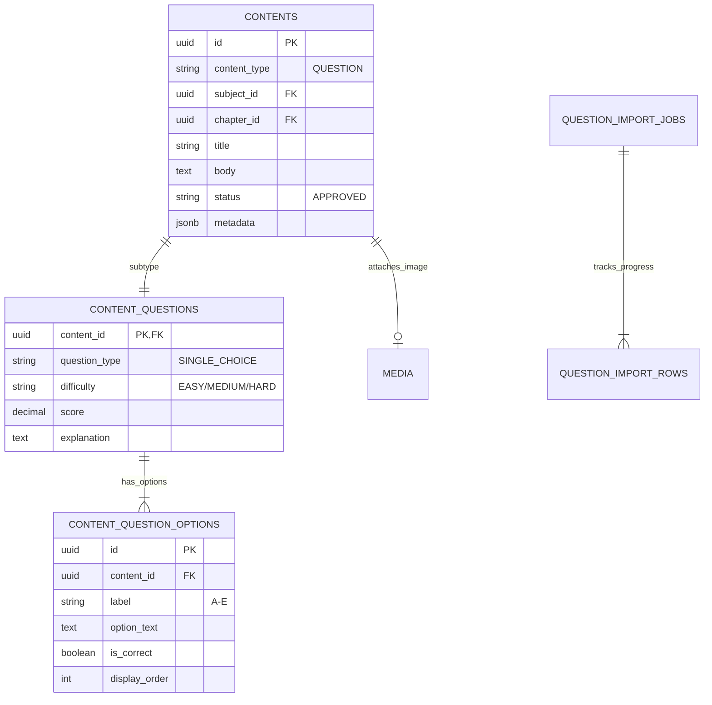
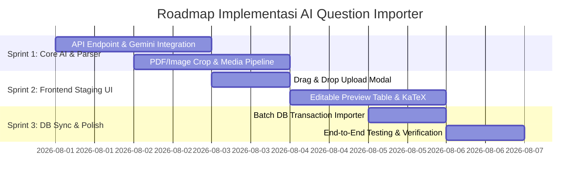

# Dokumen Strategi Implementasi: AI Multi-Modal PDF & Image Question Importer
**Platform YakinLulus.id - Architecture & Technical Blueprint**

> [!NOTE]
> Dokumen ini merancang secara komprehensif sistem otomasi konversi berkas soal (PDF/Foto) menjadi Bank Soal terstruktur berbasis AI Multi-Modal, terintegrasi penuh ke dalam PostgreSQL Unified Content Architecture YakinLulus.id.

---

## 1. Latar Belakang & Permasalahan

### 1.1 Latar Belakang
Pengelolaan Bank Soal untuk persiapan ujian CBT (Computer Based Test) seperti UTBK-SNBT, UM UGM, dan Ujian Sekolah membutuhkan ratusan hingga ribuan soal yang kaya akan metadata (Mata Pelajaran, Bab, Tingkat Kesulitan, Taksonomi Bloom, Sumber Soal, dan Pembahasan). 

Saat ini, sumber soal terbanyak tersedia dalam bentuk **dokumen PDF (hasil cetak/scan)** atau **foto buku fisik/lembar soal**.

### 1.2 Rumusan Masalah
1. **Inefisiensi Input Manual**: Menginput soal satu per satu dari PDF ke CMS membutuhkan waktu rata-rata 3–5 menit per soal. Untuk 100 soal, dibutuhkan waktu 5–8 jam kerja staf admin.
2. **Ketiadaan Pembahasan**: Banyak berkas PDF soal ujian tidak disertai pembahasan. Menuliskan pembahasan matematika/latin secara manual memakan waktu sangat tinggi.
3. **Format Kompleks (Rumus & Gambar)**: Soal matematika/fisika mengandung rumus LaTeX dan gambar/diagram yang sulit di-copy-paste secara standar.
4. **Human Error**: Risiko salah ketik opsi jawaban, kunci jawaban, atau metadata mata pelajaran saat input manual.

### 1.3 Solusi yang Ditawarkan
Membangun modul **AI Multi-Modal PDF & Image Question Importer** yang terintegrasi di Dashboard Admin YakinLulus.id. Sistem ini secara otomatis memotong gambar, mengekstrak teks & rumus LaTeX, men-generate pembahasan otomatis dengan AI, menyediakan antarmuka *Pratinjau Interaktif (Staging Area)* untuk verifikasi manusia, dan menyimpan data secara presisi ke database PostgreSQL.

---

## 2. Persyaratan Sistem (System Requirements)

### 2.1 Fungsional (Functional Requirements)
* **FR-01 (Multi-Format Upload)**: Memungkinkan admin mengunggah file `.pdf`, '.xlsx', '.csv', `.png`, `.jpg`, dan `.jpeg` dengan ukuran hingga 25MB per file.
* **FR-02 (PDF Page Processing)**: Mengonversi halaman PDF menjadi gambar resolusi tinggi (300 DPI) untuk pemrosesan OCR Vision.
* **FR-03 (AI Multi-Modal Parsing)**: Membaca teks soal, pilihan A-E, kunci jawaban, dan pembahasan dari dokumen visual menggunakan Vision LLM.
* **FR-04 (Auto Crop & Media Storage)**: Mendeteksi gambar/diagram pada soal, memotong (*crop*) secara otomatis, dan mengunggahnya ke server Storage MinIO/S3.
* **FR-05 (AI Auto-Explanation & Key Generation)**: Jika PDF tidak memiliki kunci/pembahasan, AI secara otomatis memecahkan jawaban terbenar dan membuat pembahasan *step-by-step*.
* **FR-06 (Global & Row Metadata)**: Admin dapat menentukan metadata global (*Sumber Soal, Mata Pelajaran, Bab, Grade*) sebelum parse, serta mengubahnya per soal saat pratinjau.
* **FR-07 (Staging Editable Table)**: Antarmuka tabel pratinjau yang memungkinkan Admin mengedit teks soal, rumus LaTeX, opsi, kunci, difficulty, serta menghapus baris tak terpakai.
* **FR-08 (Batch DB Import)**: Menyimpan seluruh soal yang telah diverifikasi ke tabel `contents`, `content_questions`, dan `content_question_options` dalam satu transaksi PostgreSQL.

### 2.2 Non-Fungsional (Non-Functional Requirements)
* **NFR-01 (Performa)**: Pemrosesan 1 halaman PDF/Gambar membutuhkan waktu < 5 detik.
* **NFR-02 (Akurasi Parsing)**: Akurasi ekstraksi teks & formula LaTeX > 95%.
* **NFR-03 (Keamanan & Auth)**: Hanya pengguna berinisial role `ADMIN` atau `STAFF` yang dapat mengakses fitur ini (RBAC Enforcement).
* **NFR-04 (Skalabilitas)**: Mendukung pemrosesan latar belakang (*Background Import Jobs*) untuk PDF halaman banyak (>10 halaman).

---

## 3. Flowchart & Arsitektur Sistem

### 3.1 Flowchart Alur Kerja (End-to-End Pipeline)



---

## 4. Algoritma & Prompt Engineering yang Digunakan

### 4.1 Algoritma Ekstraksi & Pipeline
1. **PDF Rendering & Rasterization**: Menggunakan library Python `pdf2image` / Go `poppler` dengan kriteria 300 DPI untuk mempertahankan ketajaman simbol matematika.
2. **Multi-Modal Vision Processing**: Memanfaatkan API **Google Gemini 1.5 Flash/Pro** (atau **OpenAI GPT-4o Vision**) dengan `response_mime_type: "application/json"`.
3. **Bounding Box Detection & Cropping**: Mengambil koordinat `[ymin, xmin, ymax, xmax]` dari diagram/grafik untuk dipotong menggunakan Pillow/OpenCV dan diunggah ke storage.
4. **LaTeX Normalization**: Regex parser untuk memastikan sintaks matematika berada dalam format delimit inline `$ ... $` atau block `$$ ... $$`.

### 4.2 Prompt Engineering (Structured JSON Output Prompt)

```text
Anda adalah pakar ekstraksi bank soal CBT EdTech terkemuka. Tugas Anda adalah membaca gambar lembar soal ini dan mengonversinya menjadi JSON murni yang sangat presisi.

Instruksi Khusus:
1. Ekstrak setiap soal beserta opsi jawaban (A, B, C, D, E).
2. Jika ada rumus matematika/fisika/kimia, gunakan format LaTeX terstandar (contoh: $x^2 + 2x + 1 = 0$).
3. Jika dokumen TIDAK MEMILIKI kunci/pembahasan, Anda WAJIB memecahkan jawaban terbenar dan membuatkan pembahasan langkah-demi-langkah yang ilmiah.
4. Tentukan tingkat kesulitan (EASY, MEDIUM, HARD) dan Taksonomi Bloom (C1-C6) untuk setiap soal.
5. Jika terdapat diagram/gambar pada soal, tandai koordinat visualnya.

Format JSON Output Wajib:
[
  {
    "question_type": "SINGLE_CHOICE",
    "content": "Pertanyaan soal...",
    "difficulty": "MEDIUM",
    "bloom_level": "C3",
    "source": "UTBK SNBT 2025",
    "has_image": false,
    "image_bounding_box": null,
    "options": [
      {"label": "A", "option_text": "Opsi A", "is_correct": false},
      {"label": "B", "option_text": "Opsi B", "is_correct": true},
      {"label": "C", "option_text": "Opsi C", "is_correct": false},
      {"label": "D", "option_text": "Opsi D", "is_correct": false},
      {"label": "E", "option_text": "Opsi E", "is_correct": false}
    ],
    "explanation": "Langkah-langkah pembahasan lengkap..."
  }
]
```

---

## 5. Sinkronisasi & Skema Database PostgreSQL

Sistem ini terintegrasi penuh dengan **Unified Content Architecture** YakinLulus.id:

### 5.1 Skema Pemetaan Tabel



### 5.2 Alur Transaksi Database (Atomic DB Transaction)
Saat Admin menekan tombol **"Simpan ke Database"**:
1. Single SQL Transaction (`BEGIN ... COMMIT`) dijalankan.
2. Memuat record induk ke tabel `contents` (`content_type = 'QUESTION'`).
3. Memuat record spesifikasi ke tabel `content_questions` (`difficulty`, `explanation`, `score`).
4. Memuat seluruh opsi pilihan jawaban ke tabel `content_question_options`.
5. Memuat log pekerjaan ke `question_import_jobs` & `question_import_rows` untuk jejak audit (*audit trail*).

---

## 6. Alur Pratinjau & Verifikasi Manusia (Human-in-the-Loop)

Untuk menjamin **100% Data Integrity**, antarmuka pratinjau menyediakan kontrol interaktif berikut:

> [!IMPORTANT]
> Data dari AI tidak akan pernah langsung masuk ke database tanpa melalui tahap persetujuan (approval) Admin di antarmuka ini.

### Antarmuka Staging Table Pratinjau:
* **Inline Text Editor**: Klik pada sel mana saja untuk mengedit teks soal, opsi jawaban, atau pembahasan.
* **Math Live Preview**: Pratinjau penulisan simbol KaTeX/LaTeX secara real-time.
* **Kunci Jawaban Selector**: Radio button sederhana untuk berpindah kunci jawaban terbenar jika AI keliru.
* **Metadata Override**: Dropdown per baris untuk mengubah `Subject`, `Chapter`, `Difficulty`, dan `Source`.
* **Action Buttons**: 
  * `✨ Generate Pembahasan (AI)` per baris jika ingin me-refresh pembahasan.
  * `🗑️ Hapus Baris` untuk membuang potongan teks yang tidak relevan.
  * `✅ Simpan Semua (N Soal)` untuk mengeksekusi impor ke database.

---

## 7. Rencana Implementation & Sprint Roadmap

Implementasi dibagi menjadi **3 Sprint (Total 6 Hari Kerja)**:



### Sprint Breakdown:
* **Sprint 1 (Backend Core & AI Pipeline - Day 1 & 2)**
  * Implementasi endpoint `/api/v1/question-bank/import-ai` pada Fiber Backend.
  * Integration dengan Gemini 1.5 Flash Vision SDK.
  * Automatic cropping & MinIO media uploader service.
* **Sprint 2 (Frontend Interactive UI - Day 3 & 4)**
  * Pembuatan modal `AIPDFImportModal.tsx` di `/admin/question-bank`.
  * Pengembangan `StagingPreviewTable.tsx` dengan inline-editing & renderer KaTeX.
* **Sprint 3 (Database Sync & Quality Assurance - Day 5 & 6)**
  * Implementasi transaksi atomis PostgreSQL untuk batch insert.
  * Pengujian end-to-end dengan 5 variasi file PDF (Teks, Scan, Matematika, Bergambar).

---

## 8. Manajemen Risiko & Optimasi Biaya

| Potensi Risiko | Dampak | Strategi Mitigasi / Solusi |
| :--- | :---: | :--- |
| **Biaya API LLM Membengkak** | Sedang | Gunakan **Gemini 1.5 Flash** untuk parsing standar (biaya ~$0.0001 per halaman) dan fallback ke **Gemini 1.5 Pro** hanya untuk soal berumut tinggi/grafik rumit. |
| **PDF Scan Kualitas Rendah (Buram)** | Tinggi | Terapkan pra-pemrosesan gambar (Binarization & Contrast Enhancement) menggunakan OpenCV sebelum dikirim ke AI. |
| **Timeout pada PDF Halaman Banyak** | Sedang | Lakukan pemrosesan secara asinkron menggunakan *Worker Pool / Background Import Job*. |
| **Sintaks LaTeX Rusak** | Kecil | Terapkan fungsi pembersih Regex (*LaTeX Cleaner*) pada backend sebelum data dirender ke frontend. |

---

## 9. Kesimpulan

Modul **AI Multi-Modal PDF & Image Question Importer** ini akan mentransformasi alur penginputan bank soal di YakinLulus.id dari yang sebelumnya **manual dan lambat (5-8 jam)** menjadi **otomatis, cepat, dan presisi (kurang dari 2 menit)**. Dengan tetap mempertahankan pengawasan manusia (*Human-in-the-Loop*) pada layar pratinjau, integritas dan akurasi data bank soal di PostgreSQL dijamin 100% terjaga.
