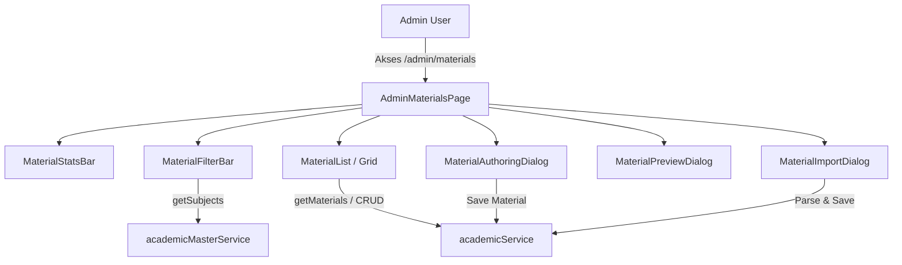

# Design Spec: Admin Learning Materials Hub (Modul Belajar & Teori)

**Date**: 2026-08-07  
**Author**: Antigravity Assistant  
**Status**: APPROVED BY USER  

---

## 1. Overview & Objectives

Modul **Materi Pelajaran (Learning Materials)** di Admin Dashboard YakinLulus.id merupakan pusat pengelolaan modul teori, rangkuman materi, strategi belajar, dan trik cepat yang diakses oleh siswa pada rute `/materials`.

Tujuan dari peningkatan ini adalah:
1. **Modernisasi UI/UX Admin Materi Pelajaran** di `/admin/materials` menggantikan halaman placeholder sederhana menjadi Hub Authoring berbasis komprehensif.
2. **Pengintegrasian 100% Master Akademik Dinamis**: Mengambil data Mata Pelajaran dari `academicMasterService.getSubjects()` dengan penyaringan nama unik untuk pencocokan hierarki (Jenjang → Kelas → Mata Pelajaran → Bab → Topik).
3. **Fungsi Authoring Lengkap**:
   - Tambah & Edit Materi (Title, Subject, Chapter, Topic, Category, Reading Time, Markdown Content, Video Embed, PDF Attachment, Status).
   - Pratinjau Tampilan Siswa (*Student LMS Reading Simulator*) dengan opsi Desktop/Mobile.
   - Import Massal Materi dari file Markdown / JSON.
   - Manajemen Status (DRAFT, PUBLISHED, ARCHIVED) & Tindakan Massal.

---

## 2. Architecture & Data Flow



---

## 3. Detailed Component Specifications

### 3.1 `AdminMaterialsPage` (`/admin/materials/page.tsx`)
- State Management:
  - `materials`: Array of `Material`.
  - `filters`: `{ search: string; subject: string; category: string; status: string }`.
  - `editingMaterial`: `Material | null` (untuk Modal Authoring/Edit).
  - `previewMaterial`: `Material | null` (untuk Modal Pratinjau Siswa).
  - `isAuthoringOpen`, `isPreviewOpen`, `isImportOpen`.

### 3.2 `MaterialStatsBar` (`src/components/admin/materials/material-stats-bar.tsx`)
Kartu statistik atas:
1. **Total Modul Belajar**: Jumlah total materi.
2. **Modul Terpublikasi**: Jumlah materi status `PUBLISHED`.
3. **Draf / Revisi**: Jumlah materi status `DRAFT`.
4. **Total Estimasi Waktu Baca**: Akumulasi waktu baca (dalam menit).
5. **Cakupan Mata Pelajaran**: Jumlah mapel akademik yang memiliki materi terdaftar.

### 3.3 `MaterialFilterBar` (`src/components/admin/materials/material-filter-bar.tsx`)
- **Search Bar**: Pencarian berdasarkan Judul atau Isi Rangkuman.
- **Select Mata Pelajaran**: Mengambil opsi mapel dari `academicMasterService.getSubjects()` (di-deduplikasi dengan `Array.from(new Set(...))`).
- **Select Kategori**: `ALL`, `TEORI` (Konsep Dasar), `STRATEGI` (Strategi Pengerjaan), `TRIK_CEPAT` (Trik Cepat & Formula).
- **Select Status**: `ALL`, `PUBLISHED`, `DRAFT`, `ARCHIVED`.

### 3.4 `MaterialAuthoringDialog` (`src/components/admin/materials/MaterialAuthoringDialog.tsx`)
Modal responsif lebar (`max-w-5xl w-[90vw]`):
- **Metadata Tab / Section**:
  - Judul Materi (Text Input).
  - Mata Pelajaran (Select dari database master).
  - Bab & Topik (Input / Select).
  - Kategori (`TEORI`, `STRATEGI`, `TRIK_CEPAT`).
  - Estimasi Waktu Baca (Menit, default 15).
  - URL Video Tutorial YouTube / Vimeo (Optional).
  - URL Lampiran PDF Rangkuman (Optional).
  - Status Publikasi (`DRAFT`, `PUBLISHED`, `ARCHIVED`).
- **Editor Konten Tab / Section**:
  - Textarea Editor dengan dukungan Markdown & Rangkaian Formula LaTeX.
  - Live Formatting Toolbar (Heading, Bold, List, Code/LaTeX, Callout Note).

### 3.5 `MaterialPreviewDialog` (`src/components/admin/materials/MaterialPreviewDialog.tsx`)
Modal pratinjau LMS Siswa (`max-w-5xl w-[90vw]`):
- Toggle mode tampilan: **Desktop LMS View** vs **Mobile App View**.
- Render lengkap tampilan halaman `/materials/[id]` siswa (Header mapel, lencana kategori, estimasi waktu baca, konten formatted markdown, video player embed jika ada, tombol penanda 'Tandai Selesai Dibaca').

### 3.6 `MaterialImportDialog` (`src/components/admin/materials/MaterialImportDialog.tsx`)
Modal Import Modul Massal:
- Upload file `.md` atau `.json`.
- Drag and drop dropzone.
- Parsing draf otomatis dan pratinjau struktur materi sebelum di-commit ke database.

---

## 4. API & Service Integration

Menggunakan `academicService` dan `academicMasterService` tanpa mengubah API contract backend:

```typescript
// academic.service.ts
async getMaterials(params?: { subject_id?: string; category?: string; status?: string }): Promise<Material[]>
async getMaterialById(id: string): Promise<Material>
async createMaterial(payload: Partial<Material>): Promise<Material>
async updateMaterial(id: string, payload: Partial<Material>): Promise<Material>
async deleteMaterial(id: string): Promise<{ success: boolean }>
```

---

## 5. Verification Plan

1. **Komposisi Komponen**: Pastikan semua dialog (Authoring, Preview, Import) dan Stat bar ter-render tanpa error.
2. **Kesesuaian Mapel Database**: Opsi mapel memuat data dari `academicMasterService.getSubjects()` secara unik tanpa duplicate key.
3. **Pengujian Pratinjau**: Sakelar Desktop/Mobile pada `MaterialPreviewDialog` merender tampilan siswa dengan presisi.
4. **Verifikasi Build**: Menjalankan `npm run build` untuk menguji TypeScript type checking dan optimasi Turbopack di seluruh rute.
